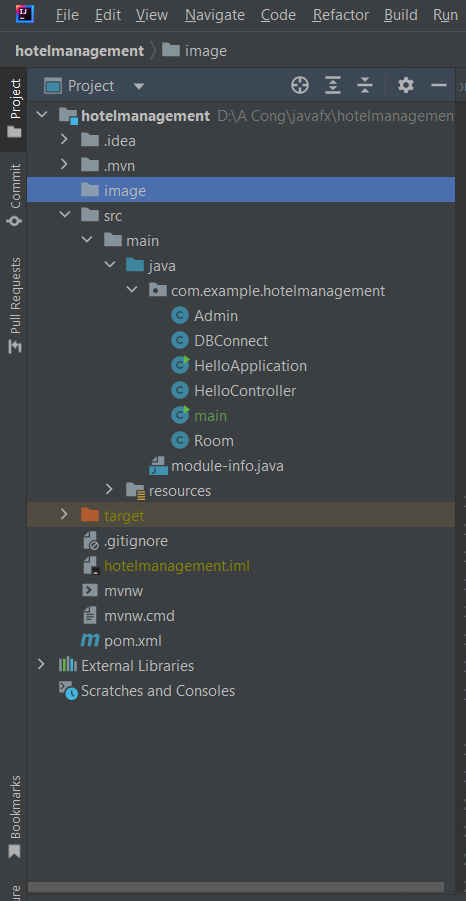
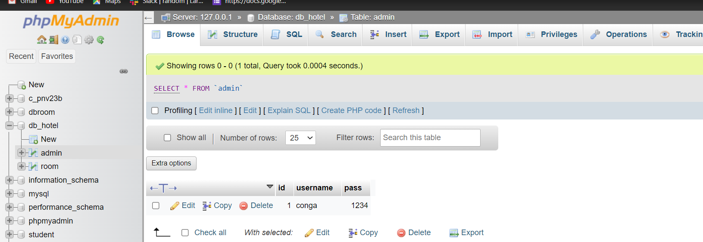
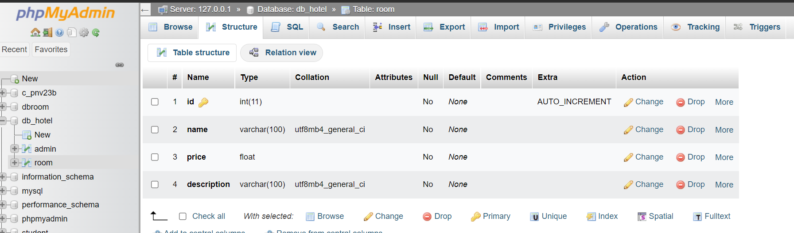

# Đồ án quản lý khách sạn
### Cấu trúc dự án

### Database

[Video demo  ](https://www.youtube.com/watch?v=A8-Jg_W_nsQ)

### Các chức năng đã làm đượ

- Login
- Xóa phòng theo id trong danh sách
- Sửa thông tin phòng trong danh sách
- Thêm phòng vào danh sách

### Các chức năng đang làm
- Đăng ký tài khoản nếu chưa có tài khoản

### Các chức năng dự định sẽ làm tiếp
- Chức năng gửi mail
- Gửi mail sau  khi đang ký account
- Tạo thêm một nút view show chi tiết sản phẩm

### Vấn đề khó khăn
- Cách lấy dữ liệu và xử lý dữ liệu trong database.
- Cú pháp Javafx khó

### Vấn đề em tâm đắc nhất trong dự án
- Khi kết nối được database truy xuất dữ liệu và show ra màn hình
- Dùng Hbox VBox
- Dùng Scane hoặc window dùng để chuyển trang
- kết hợp database và javafx
- cách fix lỗi, đọc lỗi

